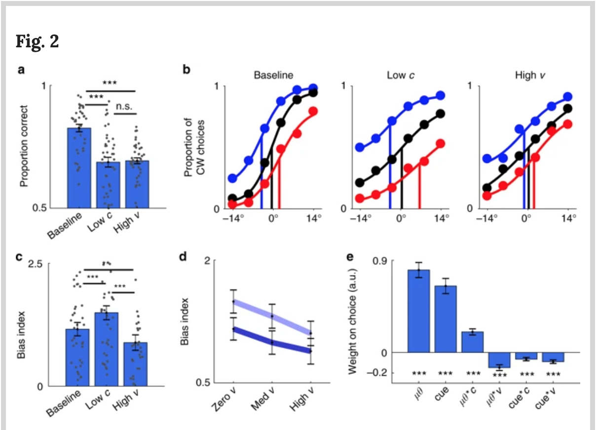

```{r setup, include=FALSE}
knitr::opts_chunk$set(
  echo = FALSE, results = "markup", warning = FALSE, cache = TRUE,
  fig.align = "center", fig.width = 6.5)
```

```{r libraries, include = F}
library("tidyverse")  # dplyr, ggplot2, and more from the tidyverse
library("magrittr")   # for pipes
library("R.matlab")   # for interacting with MatLab
library("openxlsx")   # for interacting with Excel
library("cowplot")    # for combining figures
library("plotly")     # for interactive plots

theme_set(theme_bw())
```

# Goals for next two weeks

 * Thinking about workflow in R: 
   * Version control
   * R Markdown
  
 * Data wrangling: Turning the data into the form you need (*dplyr*)
 * Data visualization:
   * General principles
   * How to plot in R (*ggplot*, *plotly*)
 
We only have a relatively short time, so we will focus on learning what tools are available and on *examples* of use (rather than an in-depth tutorial). There are great online tutorials and cheatsheets that contain further information. 
 
# Preliminaries

## Version control

RStudio makes version control, data backup, and data sharing easy (e.g., via Github.com). To use it, download and install git on your computer. Get a free github.com or bitbucket.com account. You only have to do this once.

Then, for each project, create a new project in RStudio and link it to the remote repository (select “Create project” > “Version control”). You will have to enter a URL for the remote repository, which you get, for example, at github.com under the repository’s main page by clicking the “Clone or download button”.

For step by step instructions, see:

 * [Setting up RStudio for version control](http://www.geo.uzh.ch/microsite/reproducible_research/post/rr-rstudio-git/)
 * [RStudio help on version control](https://support.rstudio.com/hc/en-us/articles/200532077?version=1.1.442&mode=desktop)
 * [Reverting a file to an earlier version](https://stackoverflow.com/questions/38465025/how-do-i-revert-to-a-previous-git-in-r-studio)


## Reproducibility and literate coding

R and RStudio support reproducibility oriented literate coding via Sweave and Knitr: lab books, presentations, and papers can weave/knit together data, code, and text. The document you share contains the code needed to create its outputs (figures, tables, etc.). This is achieved by combining latex or R markdown with R code (or, for that matter, code from other programming languages). For an excellent video-based introduction, see this [tutorial on R markdown](https://rmarkdown.rstudio.com/lesson-1.html). *This document is R markdown compiled with RStudio's knitr.


# Data wrangling

The *R* libraries *dplyr* provide us with efficient ways to transform ('wrangle') our data tables. The library *magrittr* let's us concatenate these operations in transparent and easy to read code. 

## An example data set

```{r, include=FALSE}
# Let's make some fake data
d = 
  crossing(
    condition = c("A","B","C"),
    trial = 1:64,
    subject = 1:42
  ) %>%
  mutate(
    muLogOddsCorrect = qlogis(case_when(
      condition == "A" ~ .5,
      condition == "B" ~ .61,
      condition == "C" ~ .88
    )),
    muLogRT = case_when(
      condition == "A" ~ 6.2,
      condition == "B" ~ 6.2,
      condition == "C" ~ 7.3
    )
  ) %>%
  group_by(subject) %>%
  mutate(
    muLogOddsCorrect.bySubject = rnorm(1, 0, 1.5),
    muLogRT.bySubject = rnorm(1, 0, 0.3)
  ) %>%
  rowwise() %>%
  mutate(
    correct = rbinom(1, 1, plogis(muLogOddsCorrect + muLogOddsCorrect.bySubject)),
    RT = round(exp(rnorm(1, muLogRT + muLogRT.bySubject - .2 * correct, .05)), 3)
  ) %>%
  as_tibble() %>%
  select(-starts_with("mu")) %>%
  mutate_at(c("condition", "subject"), factor)
```

We will illustrate the use of *dplyr* with the following data from an experiment with a 2AFC task in three within-subject conditions (A, B, C), for which we have extracted correctness (1 = correct; 0 = incorrect) and reaction times (RT):

```{r, echo=TRUE}
summary(d)

glimpse(d)
```


## Dplyr's verbs
Dplyr has 'verbs' like filter, select, summarize, mutate, transmute, etc. to let use conduct operations on our data, and reshape the data frame into the format we need. We can use dplyr, for example, to calculate the proportion correct answers in our experiment by using *summarise*. 

```{r, echo=T}
summarise(d, meanCorrect = mean(correct))
```

Or just for condition A:

```{r, echo=T}
d.A = filter(d, condition == "A")
summarise(d.A, meanCorrect = mean(correct))
```

## Maggritr's pipes

Here we will use only of the 'pipes' magrittr provides:

 * x %>% f: takes x and hands it to the function f on the right, as f's first argument
 * x %<>% f1 %>% f2 %>% etc.: takes x hands it to f1, takes the output of f1 and hands it to f2, etc. And since the first pipe was %<>% (rather than just %>%), the final result will be written back into x.

{width=150px}

{width=150px}

## Putting it together: Wrangling through pipes

Remember how we got the mean proportion correct for just Condition A?
```{r, echo=T}
d.A = filter(d, condition == "A")
summarise(d.A, meanCorrect = mean(correct))
```

This is inelegant and hard to read. Pipes let us make this more transparent:

```{r, echo=T}
d %>%
  filter(condition == "A") %>%
  summarise(meanCorrect = mean(correct))
```

And this advantage becomes even clearer, the more operationgs we concatenate. For example, *group_by* is an elegant operator that tells the pipes to conduct all subsequent operations for each of the groups (and then put all the separate outcomes back together into a single data frame). So if we want the proportion correct for all groups:

```{r, echo=T}
d %>%
  group_by(condition) %>%
  summarise(meanCorrect = mean(correct))
```

## Exercises

How can we: 

 * View the entire data set? (*View*)
 
 * Calculate the by-subject averages for all three conditions? (*group_by*, *summarise*)
 
 * Calculate the by-subject standard deviations around those averages? (*group_by*, *summarise*)
 
 * Attach this information (the averages and SDs) to each row of the present data.frame? (*group_by*, *mutate*)
 
 * Determine whether RTs were on average faster for correct, as compared to incorrect, trials?
 
 * Add a column for log-transformed RTs to the data set?
 
 * Remove the old column for raw RTs? (*select*)
 
 * Sort the data by log-transformed reaction times? (*arrange*)

Say we further have an additional data frame with information about our subjects:

```{r joining, echo=FALSE}
# Let's make some fake subject data.
d.subj = d %>%
  select(subject) %>%
  distinct() %>%
  rowwise() %>%
  mutate(
    gender = factor(ifelse(rbinom(1,1,.5) == 1, "female", "male")),
    age = round(rnorm(1, 20, 1), 0)
  )

print(d.subj)
```  

 * How can we join the information from the two data sources together? (*left_join*)


```{r}
d.subj
d %<>%
  left_join(d.subj)

d

```


# Data visualization

The two main libraries in R we will be using for visualization are *ggplot2* and *plotly*. Ggplot2 provides a grammar of graphics approach to plotting. Plotly let's us interact with our data. In particular, *ggplotly()* wrapped around a ggplot2 figure let's us interact with that figure.

## Ggplot2's components (aesthetic mappings)

In order to plot in ggplot2, we need to understand the way it thinks about visualization. There are excellent online course that explain all of this, so I focus on the basics. 

At the heart of a plot is a mapping between properties of your data (i.e., column in your data frame) and abstract properties of the plot (such as x- or y-coordinates, color, fill, transparency (alpha), linetype, shape, or label information). If we call the function ggplot() in order to create a figure, we specify two arguments: the name of the data frame we want to work with, and the mapping. The latter is done through a helpful function called *aes()*---for aesthetics:

```{r, echo=T, fig.height=3}
ggplot(
  data = d,
  mapping = 
    aes(
      x = condition,
      y = RT))

# or equivalently and shorter:
# ggplot(
#   d,
#   aes(
#       x = condition,
#       y = RT))
```

### Adding geometric components (geom_s)

Notice that this by itself only returns an empty plot. That's the case because we have not yet specified how we want the abstract properties of the graph to be expressed visually. That's achieved by specifying *geom*s (for geometrics), such as points (*geom_point*), lines (*geom_line*), histograms (*geom_histogram*), lineranges (*geom_linerange*), and many similar functions (I take it you're getting th hang for the naming scheme ...). You can find all of them on the [ggplot2 cheatsheet](https://rstudio.com/wp-content/uploads/2015/03/ggplot2-cheatsheet.pdf). 

We add such components to a plot with "+". We can also further explicitly specify any unused aesthetical properties of any geom. For example, to plot all the RTs for all three conditions with some transparency so that we see whether points cluster, plus some jittering along the x-axis (for the same reason):

```{r, echo=T, fig.height=3}
p = ggplot(
  data = d,
  mapping = 
    aes(
      x = condition,
      y = RT)) +
  geom_point(alpha = .1, position = position_jitter())

plot(p)
```


We could also summarize the data and plot a bootstrapped 95% confidence interval as a pointrange. In this case, we're specifying a statistical summary of the data and, as part of that, specify through which type of geom we would like it to be expressed:

```{r}
p +
  stat_summary(fun.data = mean_cl_boot, geom = "pointrange", color = "blue")
```

Alternatively, we could add a violin plot (essentially a mirrored density distribution, in this case displayed vertically on top of the points):

```{r, fig.height=3}
p +
  geom_violin(fill = NA, color = "blue")
```

### Scales and coordinate systems

Sometimes we don't want to see all of the data, or we want to zoom into some ranges of our data. We can do so by explicitly specifying the x- and y-limits of our coordinate system:


```{r, fig.height=3}
p +
  geom_violin(fill = NA, color = "blue") +
  coord_cartesian(ylim = c(300,2000))
```

Note that this zooms into parts of our data without excluding any data (e.g., from the calculation of the violins, which have the same shape as above). If we want to exclude data, transform data or in other ways change the way the aesthetical mappings are interpreted, this is achieved through *scales*. For example, the following *ex*cludes all RTs below 300 and above 2000. Note how that changes the violin plots (as it should: they estimate the ditribution of RTs):

```{r, fig.height=3}
p +
  geom_violin(fill = NA, color = "blue") +
  scale_y_continuous(limits = c(300,2000))
```

Since reaction times often have distributions that are more lognormal, rather than normal, let's update our original plot to use a log-transformed y-axis:

```{r, fig.height=3}
p = p +
  geom_violin(fill = NA, color = "blue") +
  scale_y_log10()

plot(p)
```

### Facets

If we want to have separate panels conditional on another variable, we can do so through *facet*s. There are two major facet functions, *facet_wrap* (to have panels conditional on one variable) and *facet_grid* (conditional on two variables). For example, we can have separate panels for each subject:

```{r, fig.height=12}
p +
  geom_violin(fill = NA, color = "blue") +
  facet_wrap(facets = ~ subject)
```

Or we could show by-subject RTs in two columns, separately for false and correct answers. Here, we do so after first sampling 6 random subjects (since the plot would otherwise be rather large).

```{r, fig.height=8}
# We can update a plot with new data using %+%
p %+%
  (d %>% filter(subject %in% sample(levels(subject), 6))) +
  geom_violin(fill = NA, color = "blue") +
  facet_grid(facets = subject ~ correct, labeller = label_both)
```

## Pipes (again)

Of course, we can use pipes to pipe the data frame into the plotting function, optionally after first piping the data through some additional *dplyr* operations (since the output of that entire pipe is again a data frame):

```{r, fig.height=3}
d %>%
  filter(condition != "A") %>%
  ggplot(
    aes(
      x = condition,
      y = RT)) +
  geom_point(alpha = .1, position = position_jitter()) 
```

## Exercises

 * Plot a histogram of the RTs by condition. Make on version where you plots the histograms in different facets, and another version where you have only one facet and use fill color to distinguish between conditions. (*geom_histogram*)
 * Plot the average proportion of correct answers by condition as a pointrange.
 * Do the same, but first average by subject and condition, and then plot the average (and confidence interval) of those by-subject averages of correct responses.
 * Try to make a pie chart that shows the proportion correct for the three conditions. (*coord_polar*)


# Case Study I: (Rucci group)

This study seeks to determine whether myopia affects fundamental properties of eye-movments. To this end, we compare typical and myopic subjects in a eye-movement task.

Subjects moved their eyes horizontally to target fixation points. We are interested in three dependent variables for each trial:

 * How long did it take the subject to move their eyes to the target? (reaction time)
 * How fast were their eye-movements during the fastest point of the trial? (peak velocity)
 * How long did it take to reach this peak velocity? (time to peak velocity)

None of these variables are available in the raw data, and we will have to infer / create them from the raw data.


## Design

Targets are presented at seven locations (*stimulus_deg* is one of -30, -20, -10, 0, 10, 20, 30). The total degree of horizontal movement depends on the stimulus on the previous trial, and the new stimulus on the current trial. For example, if the previous trial had a stimulus degree of -20 and the present trial has a stimulus degree of 20, that corresponds to a movement of positive 40 degrees.

## Loading data from .csv file

```{r, echo=FALSE}
d.rucci = read_csv("./data/Rucci/Michele Good Data 15-12-00.csv") %>%
  # Let's rename the session_idx variable into sth that's easier to remember (trial)
  rename(trial = session_idx) %>%
  # Let's (for now) remove all the variables about head position and rotation.
  select(-starts_with("head")) %>%
  # Let's sort the the data by trial, then time stamps (in increasing order)
  arrange(trial, Unity_timestamp, SMI_timestamp)

summary(d.rucci)
```

### Sanity check: Plotting left and right eye's x coordinate by stimulus degree

If the left and right eye are generally tracked well, then we should see that most of the data points fall onto the 45 degree diagonal when we plot the left and right eye's x-position on the x-axis and y-axis, respectively:
 
```{r}
d.rucci %>%
  ggplot(aes(x = gaze_l_x, y = gaze_r_x, color = factor(stimulus_deg))) +
  geom_hline(yintercept = 0, color = "gray") +
  geom_vline(xintercept = 0, color = "gray") +
  geom_point(alpha = .1) +
  scale_color_discrete() +
  facet_wrap(~stimulus_deg)
```

### Sanity check: Plotting left and right eye's x and y coordinates by stimulus degree

If the subject did the task, we should see that eyes primarily move along the x-axis, rather than, for example, the y-axis. For this we first need to transform that data so that we have separate rows for gaze information about the left and right eye. Then we can plot the data in a way very similar to the plot in the previous section. 

```{r}
d.rucci %>%
  pivot_longer(
    cols = starts_with("gaze"),
    names_to = c("eye", ".value"), 
    names_pattern = "gaze_(.)_(.)") %>%
  ggplot(aes(x = x, y = y, color = factor(stimulus_deg))) +
  geom_hline(yintercept = 0, color = "gray") +
  geom_vline(xintercept = 0, color = "gray") +
  geom_point(alpha = .1) +
  scale_color_discrete() +
  facet_grid(stimulus_deg ~ eye)
```


## Getting information about previous trial's stimulus

Let's calculate the change in degrees from the previous stimulus to the present stimulus. We will call this variable *stimulus_deg_delta*. This variable tells us how much and in which direction subjects had to move their eyes on the present trial.

```{r}
d.rucci %<>%
  left_join(
    d.rucci %>%
      group_by(trial) %>%
      summarise(stimulus_deg = first(stimulus_deg)) %>%
      mutate(prev_stimulus_deg = lag(stimulus_deg, default = 0))
  ) %>%
  mutate(stimulus_deg_delta = stimulus_deg - prev_stimulus_deg)

d.rucci
```


### Plot current eye position based on stimulus degree the previous stimulus degree

This plot let's us check whether subjects were doing the task. Each row shows one target (*stimulus_deg*) and each column shows where the eye-movement started off (*prev_stimulus_deg*). Color indicates the total change in stimulus degree. Take for example the first row: we see that the subject's fixation seems to always end in the same point (-.5), corresponding to the stimulus degree of the present trial (-30). Where the eye-movements start differs from column to column, depending on the stimulus degree of the previous trial.

```{r, fig.width=11, fig.height=11}
d.rucci %>%
  ggplot(aes(x = gaze_l_x, y = gaze_r_x, color = factor(stimulus_deg_delta))) +
  geom_hline(yintercept = 0, color = "gray") +
  geom_vline(xintercept = 0, color = "gray") +
  geom_point(alpha = .1) +
  scale_x_continuous("x-position (left eye)") +
  scale_y_continuous("x-position (right eye)") +
  scale_color_discrete("Change in stimulus degree") +
  facet_grid(stimulus_deg~prev_stimulus_deg, labeller = label_both) +
  theme(legend.position = "bottom")
```


## Getting information about reaction time, velocity, peak velocity, and time to peak velocity

We can calculate the speed of the eye movement at each point in time by deviding the distance traveled by the time that has passed. We can do so either along just one dimension (say x) or along any combination of dimensions. Here, we calculate the distance traveled, and speed, along the x-axis. 

TO DO: determine the appropriate definitions for these three measures. For example, the RT measure seems to contain a lot of zero values, suggesting that we're doing something wrong. Perhaps one should simply take the highest time within each trial?

```{r}
d.rucci %<>%
  group_by(trial) %>%
  # We are removing the SMI time stamp and then only keep rows that are distinct with
  # regard to the Unity time stamp, so as to avoid deriving infinitely large eye 
  # movement velocities. Other solutions might be preferred.
  select(-SMI_timestamp) %>%
  distinct() %>%
  mutate(
    gaze_l_x_distance = gaze_l_x - lag(gaze_l_x),
    gaze_r_x_distance = gaze_r_x - lag(gaze_r_x),
    # Notice how these variables are created in the order we list them within the
    # call to mutate(). Therefore the definition of the velocity variable can refer
    # to the distance variable we have just created.
    gaze_l_x_velocity = gaze_l_x_distance / (Unity_timestamp - lag(Unity_timestamp)),
    gaze_r_x_velocity = gaze_r_x_distance / (Unity_timestamp - lag(Unity_timestamp))
  )

d.rucci
```

Next, we also determine the peak velocity, time to peak velocity, and reaction time within each trial. We can summarize the data to one row per trial. Notice how we now only have 97 rows---one for each trial  (plus one for the 0th trial).

If we wanted to keep around all the within-trial msec-by-msec information, we would simply use mutate() instead of summarise(). 

```{r}
# To determine when the distance between the intended fixation target and the actual
# position of the eye is smallest, we need to translate the gaze position information
# (gaze_l|r_x) into the same scale that is used to express stimulus_deg. The following
# function will do this. 
# *********** For now it just returns that same value that it's handed. BUT THIS WILL 
# NEED TO BE CHANGED. ************
gaze_to_stimulus = function(x) {
  return(x)
}

d.rucci.byTrial = d.rucci %>%
   # Addding trial and all other relevant information that we want to keep to the 
  # grouping.
  group_by(trial, stimulus_deg, stimulus_deg_delta) %>%
  summarise(
    # Notice that we're still using the grouped data. Therefore, taking the max() 
    # of the gaze velocity returns the maximum velocity *within the current trial*.
    # (the argument na.rm = T makes sure that we ignore non-defined [NA] values 
    # during the calculation of the maximum; the same argument works for all similar
    # functions like min, mean, sd, etc.)
    gaze_l_x_peak_velocity = max(gaze_l_x_velocity, na.rm = T),
    gaze_r_x_peak_velocity = max(gaze_r_x_velocity, na.rm = T),
    gaze_l_x_time_to_peak_velocity = 
      min(Unity_timestamp[which(gaze_l_x_velocity == gaze_l_x_peak_velocity)]) - 
      min(Unity_timestamp),
    gaze_r_x_time_to_peak_velocity = 
      min(Unity_timestamp[which(gaze_r_x_velocity == gaze_r_x_peak_velocity)]) - 
      min(Unity_timestamp),
    gaze_l_RT = 
      min(Unity_timestamp[which(gaze_to_stimulus(gaze_l_x) - stimulus_deg == 
              min(gaze_to_stimulus(gaze_l_x) - stimulus_deg))]) - min(Unity_timestamp),
    gaze_r_RT = 
      min(Unity_timestamp[which(gaze_to_stimulus(gaze_r_x) - stimulus_deg == 
              min(gaze_to_stimulus(gaze_r_x) - stimulus_deg))]) - min(Unity_timestamp)
  )

d.rucci.byTrial
```

### Plotting these trial-level properties by trial type (and, in the future, subject type)

Ultimately, we would want to analyze the effect of between-subject variables (in pariculuar, myopic vs. non-myopic) on the trial-level variables we've derived above (peak velocity, time to peak velocity, and reaction time). Since we so far only have the data from one subject, we can instead plot these trial-level variables as a function of the different trial types:

```{r}
d.rucci.byTrial %>%
  # remove 0th trial since it has extreme (and irrelevant) values
  filter(trial != 0) %>%
   pivot_longer(
    cols = starts_with("gaze"),
    names_to = c("eye", "measure"), 
    names_pattern = "gaze_(.)_(.*)") %>%
  # once there's more data, this should be aggregated by subejct, so that there 
  # is one data point per subject and condition
  ggplot(aes(x = stimulus_deg, y = value, color = factor(stimulus_deg_delta))) +
  stat_summary(fun.data = mean_cl_boot, geom = "pointrange",
               position= position_dodge(3), na.rm = T) +
  scale_x_continuous("Stimulus degree") +
  scale_y_continuous("mean") +
  scale_color_discrete("Change in stimulus degree") +
  facet_grid(measure ~ eye, labeller = label_both, scales = "free_y") +
  theme(legend.position = "bottom") 
```


# Case Study II: visual decision-making (Haefner group)

This group seeks to replicate [Herce Castañón et al. (2019)](https://www.nature.com/articles/s41467-019-09330-7).



## Design

The design of the present study crossed two levels of contrast (Low = 15%, High = 60%), 3 levels of variance (0, 4, 10), and how the trials in the block were cued (L = left, R = right, N = uncued), for a total of 2 x 3 x 3 = 18 within-subject conditions.

## Loading data from MatLab

The data are stored in a MatLab (.mat) file. The file contains one matrix with fields: participant, exp(eriment), stimuli and response. Within each field, there is further information. The important information seems to be in the response field. Some of the important parts include:

 * responseRight: the response of the subject (0 for CCW, 1 for CW, w.r.t horizontal)
 * correct: what the correct answer is (0 for CCW, 1 for CW, w.r.t horizontal)
 * accuracy: whether subject got the correct answer (1) or not (0)
 * reaction time: time in seconds the subject took to answer
 * confidence: whether the subject was confident in their answer (1) or not (-1)
 * cue: whether the cue on that trials is left (-1), right (1), or no cue (0)
 * contrast: the contrast of the gabor patch on that trial
 * variance: variability in the orientation of gratings of gabor patches on that trial
 * isCuedBlock: whether a block (of trials) will have cues (1) or no cues (0)

```{r load data, results="hide", echo=T}
# Load a matlab file and extract the "data" matrix out of it
d.haefner = readMat("./data/Haefner/uncertaintyV1-subject18-1-EarlyQuit.mat")
d.haefner = d.haefner[["data"]][,,1][["response"]][,,1]
d.haefner[["trueOrientaions"]] <- NULL

# Look at what we've imported. 
# NB: str() gives your the structure of an R object
str(d.haefner)

d.haefner %<>%
  map(.f = function(x) c(x)) %>%
  as_tibble() 

# The data we have are preliminary pilot data from one of the 
# experimenters, and that run did contain all trials. We omit 
# all the trials with missing information.
d.haefner %<>%
  na.omit()

# Add the definition of the three conditions of interest in the
# original paper
d.haefner %<>%
  mutate(
    condition = case_when(
        variance == min(variance) & contrast == max(contrast) ~ "baseline",
        variance == max(variance) & contrast == max(contrast) ~ "high variance",
        variance == min(variance) & contrast == min(contrast) ~ "low contrast",
        T ~ ""
    )
  )
```


Now that we've imported the data into an R data frame (or *tibble*), let's have a look at it. First, we can get a general idea of the data by using str() (for structure) or print():

```{r}
# NB: if you call an R object without any function, R
#     automatically applies the print() function to the
#     object. For a tibble/data.frame this provides an
#     overview.
d.haefner
# same as print(d.haefner)

# To view the entire data, use View(d.haefner)
# To get a glimpse, use glimpse(d.haefner)
```

To instead get a summary of the data:

```{r}
summary(d.haefner)
```

## Figure 2 from Herce Castañón et al.


### Panel A

We begin by plotting the proportion of correct choices for *all* conditions:

```{r}
p = position_dodge(.9)

p1 = d.haefner %>%
  ggplot(
    aes(x = factor(contrast),
        y = accuracy)
  ) +
  stat_summary(fun.y = mean, geom="bar", position=p) +
  stat_summary(fun.data = mean_cl_boot, geom = "linerange", position=p) +
  facet_wrap(~ cue) +
  scale_x_discrete(
    "Contrast",
    breaks = c(.15, .6),
    labels = c("low", "high")
  ) +
  scale_y_continuous("Proportion correct") +
  scale_fill_discrete("Variance")

plot(p1)
```

### Panel B

We begin by plotting the proportion of CW choices for *all* conditions:


```{r, warning=FALSE}
p2 = d.haefner %>%
  ggplot(
    aes(x = orientationMean,
        y = responseRight,
        color = factor(cue))
  ) +
  stat_summary(
    data = d.haefner %>%
      mutate(orientationBin = ntile(orientationMean, 6)) %>%
      group_by(cue, contrast, variance, orientationBin) %>%
      summarise_at(
        c("orientationMean", "responseRight"),
        mean),
  # could be changed to pointrange and mean_cl_boot, once there are
  # several subjects
    fun.y = mean, geom = "point") + 
  geom_smooth(method = "glm", 
              se = FALSE, # remove to see CIs
              method.args = list(family = binomial)) +
  facet_grid(contrast ~ variance, 
             labeller = 
               labeller(.rows = label_both, .cols = label_both)) +
  scale_x_continuous("mean orientation\n(relative to horizontal)") +
  scale_y_continuous("Proportion of\nCW choices") +
  scale_color_manual(
    "Cue",
    breaks = c(-1,0,1),
    labels = c("left", "none", "right"),
    values = c("red", "black", "blue")
  ) 

p2
```


```{r, include=FALSE}
# if one wanted to share the facets of interest
p2 +
  geom_rect(
    data = d.haefner %>% 
      group_by(contrast, variance, condition) %>%
      summarise(),
    inherit.aes = F,
    aes(fill = condition),
    xmin = -Inf, xmax = Inf,
    ymin = -Inf, ymax = Inf, alpha = 0.2) +
  scale_fill_manual(
    "Condition",
    breaks = c("", "baseline", "high variance", "low contrast"),
    values = c(NA, "green", "yellow", "orange")
  )
```

### Panel A and B together

```{r, fig.width=10, fig.height=5}
p1 = d.haefner %>%
  filter(condition != "", cue == 0) %>%
  mutate(condition = factor(condition, 
                            levels = c("baseline", "low contrast", "high variance"))) %>%
  ggplot(
    aes(x = condition,
        y = accuracy)
  ) +
  stat_summary(fun.y = mean, geom="bar", position=p, fill = "blue", alpha = .5, color = NA) +
  stat_summary(fun.data = mean_cl_boot, geom = "linerange", position=p) +
  scale_x_discrete("") +
  scale_y_continuous("Proportion correct") +
  coord_cartesian(ylim = c(0,1)) +
  theme(
    panel.grid.major = element_blank(),
    panel.grid.minor = element_blank()
  )

p2 = d.haefner %>%
  filter(condition != "") %>%
  mutate(condition = factor(condition, levels = c("baseline", "low contrast", "high variance"))) %>%
  ggplot(
    aes(x = orientationMean,
        y = responseRight,
        color = factor(cue))
  ) +
  stat_summary(
    data = d.haefner %>%
      filter(condition != "") %>%
      mutate(orientationBin = ntile(orientationMean, 6)) %>%
      group_by(cue, condition, orientationBin) %>%
      summarise_at(
        c("orientationMean", "responseRight"),
        mean),
    fun.y = mean, geom = "point") + 
  geom_smooth(method = "glm", 
              se = FALSE, # remove to see CIs
              method.args = list(family = binomial)) +
  facet_wrap(~ condition) +
  scale_x_continuous("mean orientation (relative to horizontal)") +
  scale_y_continuous("Proportion of CW choices") +
  scale_color_manual(
    "Cue",
    breaks = c(-1,0,1),
    labels = c("left", "none", "right"),
    values = c("red", "black", "blue")
  ) +
  theme(
    panel.grid.major = element_blank(),
    panel.grid.minor = element_blank(),
    legend.position = "top"
  )

plot_grid(
  plotlist = list(p1, p2),
  nrow = 1,
  rel_widths = c(.30, .70),
  labels = c("a", "b"),
  align = "hv",
  axis = "bt"
)
```


# Case Study III: (Huxlin group)

## Load data from Excel files
```{r}
# d.huxlin = read.xlsx(xlsxFile = "./data/Huxlin/pattern_test.xlsx", sheet = "RHN 1")
# 
# summary(d.huxlin)
```
# Session info
```{r session_info, echo=FALSE, results='markup'}
devtools::session_info()
```
